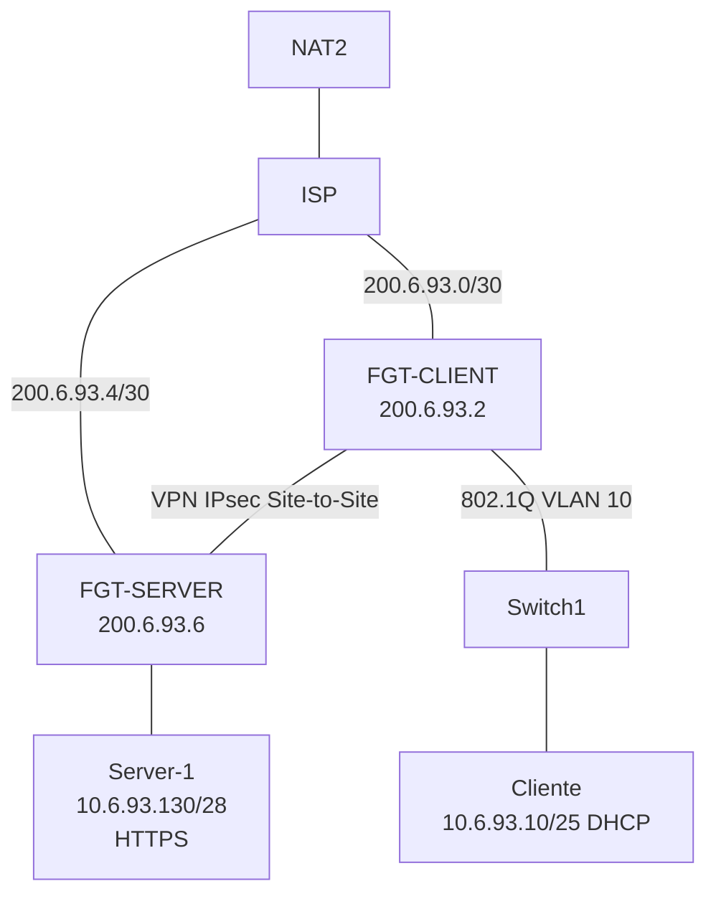
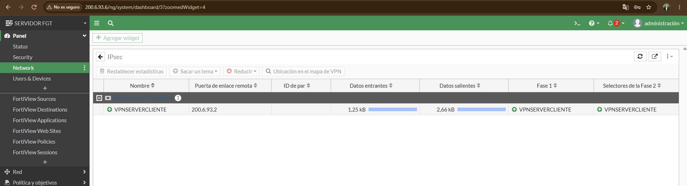
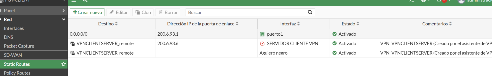

# Infraestructura 1 — VPN Site-to-Site con FortiGate

> **Video de demostración:** PENDIENTE_DE_COLOCAR_ENLACE_YOUTUBE_O_ONEDRIVE

**Estudiante:** Jose Miguel Diaz Ferreras  
**Matrícula:** 2025-0693

## Propósito del laboratorio

Implementar y validar una infraestructura de seguridad en GNS3 donde un **Cliente** se comunica con un **Servidor Web HTTPS** únicamente a través de un enlace **VPN IPsec Site-to-Site** entre dos FortiGate. La práctica incluye direccionamiento basado en la matrícula, VLAN 10, DHCP, NAT de salida, redes públicas simuladas mediante un ISP y verificación de que el acceso Cliente–Servidor deja de funcionar cuando se deshabilita la ruta que utiliza el túnel VPN.

## Topología



## Direccionamiento

| Equipo / segmento | Dirección | Función |
|---|---|---|
| ISP Gi1/0 | 200.6.93.1/30 | Enlace público hacia FGT-CLIENT |
| FGT-CLIENT port1 | 200.6.93.2/30 | WAN |
| ISP Gi2/0 | 200.6.93.5/30 | Enlace público hacia FGT-SERVER |
| FGT-SERVER port1 | 200.6.93.6/30 | WAN |
| FGT-CLIENT VLAN10 | 10.6.93.1/25 | Gateway de usuarios |
| Cliente | 10.6.93.10/25 | Dirección recibida por DHCP |
| FGT-SERVER port2 | 10.6.93.129/28 | Gateway de red del servidor |
| Server-1 | 10.6.93.130/28 | Servidor HTTPS |

## VLAN 10 y DHCP

La VLAN 10 está creada como subinterfaz de `port2` en FGT-CLIENT con dirección `10.6.93.1/25`. El rango DHCP es `10.6.93.10–10.6.93.100`. Switch1 utiliza un enlace 802.1Q hacia el FortiGate y un puerto access en VLAN 10 hacia el Cliente. El Cliente obtuvo `10.6.93.10/25` y gateway `10.6.93.1` mediante DHCP.

## ISP y salida a Internet

El router ISP utiliza `200.6.93.1/30` hacia FGT-CLIENT y `200.6.93.5/30` hacia FGT-SERVER. `FastEthernet0/0` obtiene dirección por DHCP desde NAT2 y el ISP posee una ruta por defecto hacia `192.168.42.1`. El NAT externo es proporcionado por el nodo NAT2 de GNS3; no se configura NAT IOS en el router ISP.

## NAT en FortiGate

Ambos FortiGate poseen una política `LAN-to-WAN` con NAT habilitado para la salida de sus redes internas. Las políticas que atraviesan el túnel IPsec no utilizan NAT.

## VPN IPsec Site-to-Site

FGT-CLIENT establece `VPNCLIENTSERVER` desde `200.6.93.2` hacia el peer `200.6.93.6`. FGT-SERVER establece `VPNSERVERCLIENT` desde `200.6.93.6` hacia `200.6.93.2`. La PSK fue excluida intencionalmente del repositorio. Las configuraciones relevantes de Fase 1 y Fase 2 se encuentran en `configs/`.



## Servidor HTTPS

Server-1 usa `10.6.93.130/28`, gateway `10.6.93.129` y Nginx escuchando en TCP/443 con SSL. La página de prueba devuelve:

```html
<h1>Servidor Web HTTPS - 2025-0693</h1>
```

## Pruebas de cumplimiento

El traceroute desde Cliente alcanza primero `10.6.93.1` y finalmente `10.6.93.130`. Con la ruta VPN activa, `curl -k https://10.6.93.130` devuelve correctamente la página HTTPS. Al deshabilitar desde la GUI de FGT-CLIENT la ruta `VPNCLIENTSERVER_remote`, el mismo `curl` falla con `Failed to connect`. Al habilitar nuevamente la ruta, el acceso HTTPS vuelve a funcionar. Esto demuestra que la comunicación entre las redes privadas depende del camino VPN configurado.



## Configuraciones incluidas

- `configs/FGT-CLIENT.conf`: interfaces, VLAN 10, DHCP, rutas, políticas y VPN.
- `configs/FGT-SERVER.conf`: interfaces, rutas, políticas y VPN.
- `configs/ISP-running-config.txt`: running-config relevante del ISP.
- `configs/Cliente.txt`: direccionamiento DHCP y pruebas de traceroute/HTTPS.
- `configs/Server-1.txt`: direccionamiento, ruta y configuración HTTPS.
- `scripts/README.md`: registro sobre scripts utilizados.
- `docs/diagrama.md`: diagrama lógico adicional.

## Seguridad del repositorio

Las claves precompartidas de IPsec no se publican. Los valores `psksecret` fueron eliminados de los archivos del repositorio.

## Guion breve para el video (máximo 10 minutos)

Mostrar fecha y hora, rostro y voz; enseñar la topología; mostrar VLAN 10/DHCP y las interfaces; mostrar las dos fases del IPsec activas; ejecutar traceroute y HTTPS desde Cliente; deshabilitar por GUI la ruta VPN y demostrar que HTTPS falla; volver a habilitarla y demostrar que HTTPS funciona nuevamente. La demostración debe centrarse únicamente en el objetivo de seguridad solicitado.
