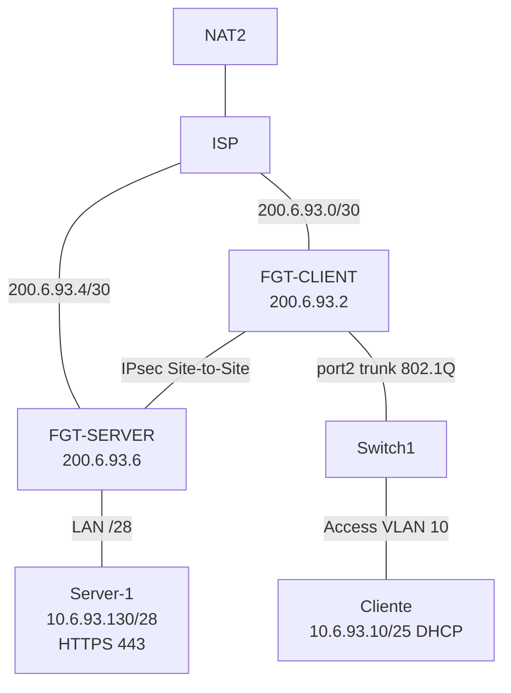

# Diagrama lógico

```mermaid
flowchart TB
    NAT2[NAT2] --- ISP[ISP]
    ISP ---|200.6.93.0/30| FC[FGT-CLIENT\n200.6.93.2]
    ISP ---|200.6.93.4/30| FS[FGT-SERVER\n200.6.93.6]
    FC ---|IPsec Site-to-Site| FS
    FC ---|port2 trunk 802.1Q| SW[Switch1]
    SW ---|Access VLAN 10| C[Cliente\n10.6.93.10/25 DHCP]
    FS ---|LAN /28| S[Server-1\n10.6.93.130/28\nHTTPS 443]
```
